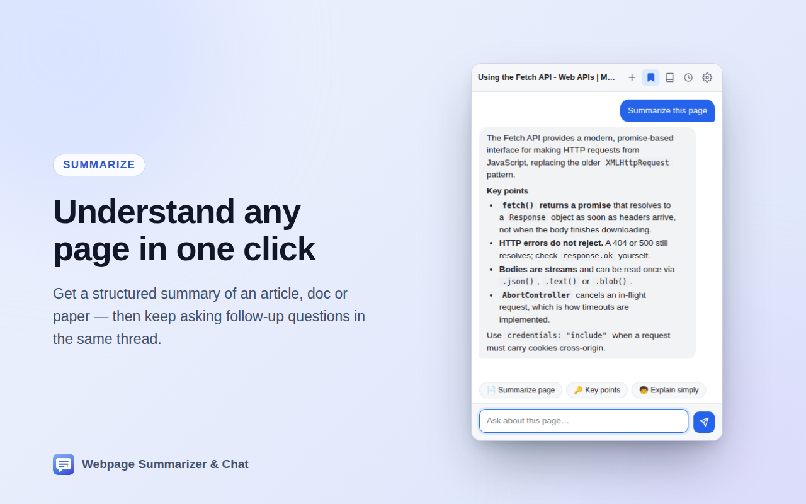

# Webpage Summarizer & Chat

A Chrome extension that lets you chat with any webpage or YouTube video using OpenAI — summaries, Q&A, key points — and save pages into a searchable **knowledge base** with smart AI indexing. Everything is stored locally. No account needed.

<p align="center">
  
</p>

## Features

- **Webpage summarization** — extract and summarize the main content from any webpage
- **YouTube video summarization** — automatically opens the transcript panel, extracts captions, and generates a summary with key learnings and takeaways
- **Interactive chat** — ask follow-up questions about the page/video; the page content is extracted once and reused for the whole conversation
- **Knowledge base** — save any page with one click. Each saved page is auto-enriched with an AI title, summary, topic tags, and keywords (*smart indexing*), then is findable later through **hybrid search** (keyword + meaning-based semantic search). The **Ask** tab answers questions across everything you've saved, with inline citations to the source pages (RAG)
- **Per-page persistence** — chats are saved locally (in `chrome.storage.local`) and keyed to the page URL. Close the popup, click elsewhere, restart the browser — reopen the popup on the same page and your conversation is right where you left it
- **Chat history** — browse, reopen, continue, or delete past conversations from any page. Continuing an old chat reuses that page's saved content, even if you're no longer on the page
- **Streaming responses** — answers render token-by-token; if the popup closes mid-response, the background finishes the generation and saves it
- **Draft preservation** — text typed into the input box survives the popup closing
- **Markdown rendering** — headings, bullets, bold, code blocks, and links in responses (HTML-escaped, no injection)
- **Quick actions** — one-tap chips for "Summarize", "Key points", and "Explain simply"
- **Dark mode** — follows your system theme
- **Keyboard shortcut** — `Alt+Shift+S` opens the popup (configurable at `chrome://extensions/shortcuts`)
- **Accessible** — every control is reachable and operable from the keyboard, with labelled buttons, polite status announcements and visible focus rings
- **Your data, in your hands** — export everything to JSON or erase all of it from Settings

## Installation

### From Source

1. Clone this repository:
   ```bash
   git clone https://github.com/puscas-sergiu/webpage-context.git
   cd webpage-context
   ```

2. Open Chrome and navigate to `chrome://extensions/`

3. Enable "Developer mode" (toggle in the top right)

4. Click "Load unpacked" and select the project directory

5. The extension icon should now appear in your Chrome toolbar

## Configuration

1. Get your API key from [OpenAI's platform](https://platform.openai.com/api-keys)
2. Click the extension icon — you'll be taken to Settings on first run
3. Paste your OpenAI API key, optionally pick a model (defaults to `gpt-5-nano`)
4. Click "Save & test" — the extension verifies the key works

## Usage

### Summarizing

1. Navigate to any webpage (or YouTube video)
2. Open the popup and tap the **📄 Summarize page** (or **🎬 Summarize video**) chip
3. The summary streams in; for videos the transcript panel is opened automatically

### Chatting

- Type a question and press Enter (Shift+Enter for a new line)
- The conversation — including the extracted page content — is kept for follow-up questions
- Click **+** in the header to start a fresh chat; the old one stays in History

### History

- Click the **clock icon** to see all saved chats, grouped by date
- Click a chat to reopen and continue it (works even from a different page — replies use the saved page content)
- Hover a chat and click the trash icon twice to delete it, or use "Clear all"

### Knowledge Base

- Click the **bookmark icon** in the header to save the current page (or video). The icon fills in once saved; click again to remove it. Saving extracts the page content immediately, then enriches it in the background with an AI title, summary, tags, and a semantic embedding
- Click the **book icon** to open the Knowledge Base:
  - **Browse** — search your saved pages. Choose **Hybrid** (default — blends keyword and meaning), **Keyword** (instant, offline, exact terms), or **Semantic** (meaning-based, finds synonyms). Click a result to open the page; delete with the trash icon (twice to confirm)
  - **Ask** — ask a question across everything you've saved. The most relevant pages are retrieved and the model answers with inline `[1]`, `[2]` citations linking back to the sources
- Semantic search and Ask use OpenAI embeddings (`text-embedding-3-small`), which add a small API cost per saved page. Turn this off in Settings to keep the knowledge base keyword-only and free

### Managing your data

Open **Settings → Your data** to see how much is stored, export everything to a JSON file
(your API key is excluded), or delete all conversations, drafts, saved pages, embeddings
and the search index in one go. Uninstalling the extension removes everything too.

## Building and publishing

The extension has no build step for development — "Load unpacked" runs the source
directly. The scripts in `tools/` exist to produce the Chrome Web Store artefacts, and
need Node 22+ and a Chrome/Chromium binary (set `CHROME=/path/to/chrome` if it is not
found automatically).

```bash
bash tools/build.sh                  # dist/webpage-summarizer-chat-<version>.zip
node tools/make-store-assets.mjs     # store/screenshots + promo tiles
bash tools/make-icons.sh             # icon16/32/48/128.png from tools/*.svg
```

`tools/build.sh` packages only the ten files the extension actually loads, and fails if
anything referenced by `manifest.json`, `popup.html` or `importScripts()` is missing.

The store screenshots are real renders, not mockups: `tools/make-store-assets.mjs` runs
the actual popup against `tools/preview/mock.js`, a stub of the `chrome.*` APIs, then
frames the result. Change the UI and the screenshots regenerate to match.

Submission copy — description, single purpose statement, per-permission justifications,
data-usage declarations and an upload checklist — lives in
[`store/LISTING.md`](store/LISTING.md).

## Architecture

```
popup.html / popup.js / styles.css   UI only — renders state, streams deltas
background.js                        Owns everything: extraction, OpenAI calls,
                                     streaming, conversation + knowledge-base logic
kb-db.js                             IndexedDB wrapper for the knowledge base
                                     (bookmarks, embedding vectors, lexical index)
```

The background service worker is the source of truth. The popup asks it for the current page's conversation on open (`getState`) and renders it; generation events (`genStatus`, `genDelta`, `genDone`, `genError`) are broadcast so the popup can attach/detach freely — including reattaching to a generation already in progress.

### Storage layout (`chrome.storage.local`)

| Key | Contents |
|---|---|
| `convIndex` | Lightweight index of all conversations (for the History list) |
| `urlActive` | Map of normalized page URL → active conversation id |
| `conv:<id>` | Full conversation: messages + extracted page content |
| `drafts` | Unsent input text per page |

URLs are normalized (hash and `utm_*`/`fbclid`/`gclid` parameters stripped) so the same article maps to the same chat. History is capped at 100 conversations, pruned oldest-first.

### Knowledge base storage (IndexedDB)

The knowledge base lives in its own IndexedDB database (`webpageKB`), separate from chat conversations, because embedding vectors and extracted page text are too large for `chrome.storage.local`'s ~10MB cap (hence the `unlimitedStorage` permission). Three object stores:

| Store | Contents |
|---|---|
| `bookmarks` | Saved page: url, title, AI title/summary/tags/keywords, extracted content, indexed by normalized URL (dedupe on re-save) |
| `vectors` | One embedding per bookmark, stored as a `Float32Array` |
| `invIndex` | Inverted index (term → postings) powering instant keyword search |

Search blends a normalized lexical score with cosine similarity over the embeddings; **Ask** retrieves the top matches and feeds them to the chat model as cited context.

### API

- **Model**: `gpt-5-nano-2025-08-07` by default; selectable in Settings
- **Endpoint**: `https://api.openai.com/v1/chat/completions` with `stream: true` (falls back to non-streaming automatically if the account/model rejects streaming)
- **Content limit**: extracted content truncated to 24,000 characters; the last 24 messages are sent per request

## Privacy & Security

- No backend, no account, no analytics, no tracking. The only host the extension contacts is `api.openai.com`
- Your OpenAI API key is stored in Chrome's sync storage, so it follows your signed-in Chrome profile between devices — turn off extension syncing in Chrome if you would rather it stayed on one machine
- Conversations and saved pages are stored **only on your device**; they are never synced
- Content extraction happens locally, and only for the tab you are viewing, after you open the popup
- Model responses are rendered through an HTML-escaping markdown renderer (no raw HTML injection)

The full policy is in [PRIVACY.md](PRIVACY.md).

## Permissions Explained

- **activeTab** — read the current tab's URL/title and content when you open the popup
- **storage** — store your API key, settings, and conversation history
- **unlimitedStorage** — give the knowledge base (IndexedDB) room for saved pages and embeddings beyond the default quota
- **scripting** — inject the content/transcript extraction functions into the page
- **host_permissions (`https://api.openai.com/*`)** — make API calls to OpenAI (chat completions and embeddings)

Notably absent: no `tabs` permission (`activeTab` covers the one tab you are on), no
broad host permissions, and no content scripts running on page load.

## Limitations

- Requires an active OpenAI API key with sufficient credits
- Extracted content is truncated to 24,000 characters
- YouTube videos must have transcripts/captions available
- Cannot read restricted pages (`chrome://`, the Chrome Web Store, etc.) — but past chats remain accessible from History

## Troubleshooting

- **"OpenAI API key not set"** — add a valid key in Settings
- **"Could not extract YouTube transcript"** — ensure the video has captions; try opening the transcript panel manually first
- **"Invalid OpenAI API key" (401)** — the key is invalid or expired; update it in Settings
- **"Rate limit or quota exceeded" (429)** — check your OpenAI account usage and billing
- **Chat seems stale after the page changed** — hit Summarize again to re-extract, or start a new chat with **+**

## Contributing

Contributions are welcome! Please feel free to submit a Pull Request.

Changes to `popup.html`, `popup.js` or `styles.css` should be followed by
`node tools/make-store-assets.mjs` so the screenshots in `store/` and the README stay in
step with the UI.

## Changelog

See [CHANGELOG.md](CHANGELOG.md).

## License

[MIT](LICENSE).

## Author

**puscas-sergiu**
